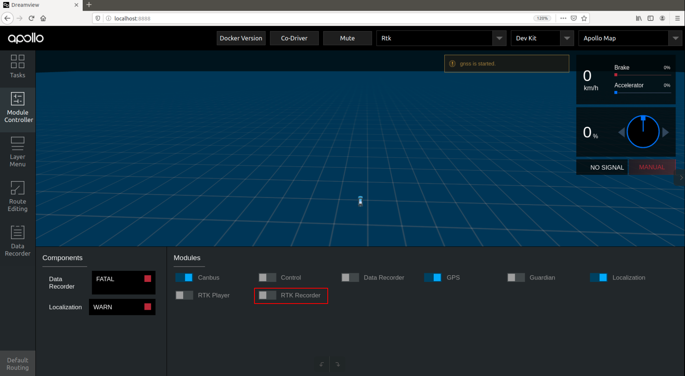

## 操作步骤
### 1. 启动can卡
```
cd ~/SocketCAN/
bash start.sh
```
### 2.  启动dreamview
```
cd ~/Desktop/apollo
bash apollo.sh
bash scripts/bootstrap.sh
```
运行后结果如图：


### 3. 启动所需模块
在浏览器中打开(http://localhost:8888)，在--setup mode--内，选择模式为Rtk， 在--vehicle--选择车型，如使用Apollo D-KIT Lite，则在--vehicle--选择车型Dev Kit。

在页面左上角处点击Module Controller页面标签，进入到软件模块启动界面， 点击侧启动Canbus模块、GPS模块、Localization模块：

### 4. 检查各模块数据是否正确
在docker中输入cyber_monitor命令并检查以下channel（使用上下方向键选择channel，使用右方向键查看channel详细信息。
channel_name	检查项目
/apollo/canbus/chassis	确保能正常输出数据
/apollo/canbus/chassis_detail	确保能正常输出数据
/apollo/sensor/gnss/best_pose	确保能正常输出数据、sol_type: 选项显示为NARROW_INT
/apollo/localization/pose	确保能正常输出数据

### 5. 循迹录制
1）在空旷场地内，将车辆遥控至循迹起点，记录此时车辆车头方向和所在位置：
 - 将遥控器按钮置于手动驾驶模式；
 - 记录此时车辆起点位置；


2）启动Rtk_Recorder录制循迹数据：
在Dreamview页面内，在Module Controller，点击RTK Recorder按钮，启动循迹录制，录制循迹数据：

这时使用遥控器，遥控车辆前进一段轨迹，到达期望的终点，车辆停止后，在Dreamview页面点击RTK Recorder按钮，关闭循迹数据录制。
注意：请务必在车辆到达终点后快速关闭RTK Recorder按钮，否则可能会导致记录多余无用数据，或者只打开不关闭RTK Recorder按钮，可能会导致后续循迹回放无法进行！

结束录制循迹轨迹后，录制的循迹数据在apollo/data/log/garage.csv中，文件内包含了车辆的轨迹、速度、加速度、曲率、档位、油门、刹车、转向等信息。


